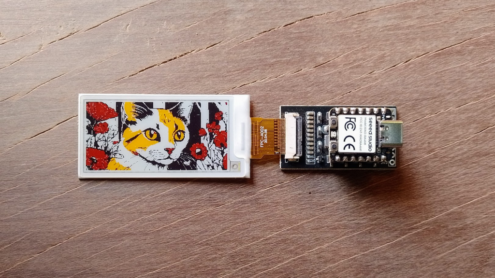

# Color bitmaps

This is an example of how to display a multi-color bitmap on the ePaper.

 

## Contact

You can contact me and see the rest of my work at: 

- Github: [@profetolocka](https://github.com/profetolocka)
- Blog: [Profe Tolocka](https://www.profetolocka.com.ar)
- Social: [linktr.ee](https://linktr.ee/profetolocka)
