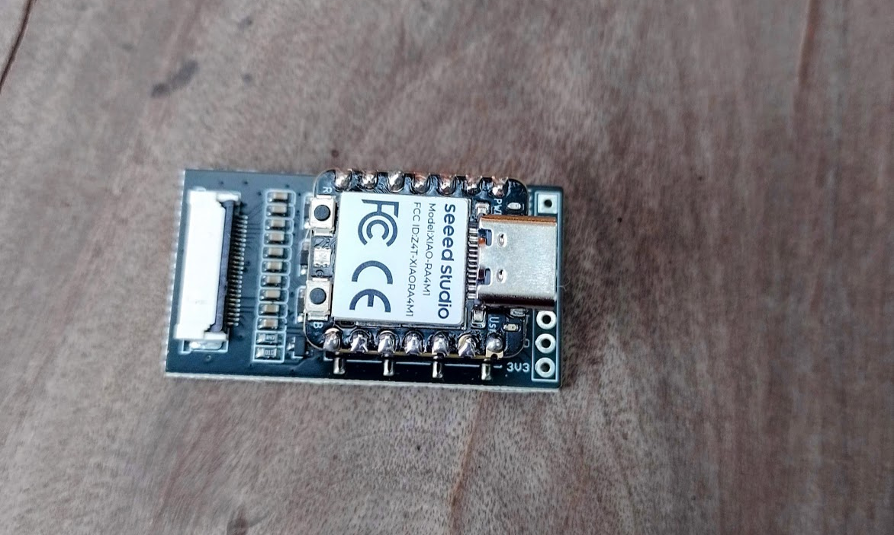

# GDEY0213F51-GXEPD2
 

[Go to english version](#Projects-for-M5Stick-Made-in-UIFlow-V1)

# Ejemplos de uso del ePaper GDEY0213F51 con la librería GXEPD2 en Arduino

## Introducción

Este repositorio tiene por finalidad mostrar distintos ejemplos de aplicación del ePaper GDEY0213F51-GXEPD2 en combinación con la placa adaptadora de Seeed Studio. 

## Contenido

El repositorio está organizado en carpetas, cada una conteniendo un proyecto completo. Cada carpeta contiene un archivo README con explicaciones y otra información adicional.

La carpeta **Pruebas** contiene programas simples para comprobar ideas o el funcionamiento de algunos componentes del M5Stick

## Licencia

Todos los proyectos son de **código abierto** (open source y open hardware) y están publicados bajo una licencia **MIT**.

## Contacto

Puedes contactarme y ver el resto de mi trabajo en:

- Github: [@profetolocka](https://github.com/profetolocka)
- Blog: [Profe Tolocka](https://www.profetolocka.com.ar)
- Redes: [linktr.ee](https://linktr.ee/profetolocka)

# Projects for M5Stick Made in UIFlow V1

## Introduction

This repository aims to showcase the projects I have developed with the M5Stick C Plus 2 programmed in UIFlow Version 1. It is a collection of projects created over time and includes test programs, utilities, and specific projects, ranging from simple and straightforward applications to more complex projects.

If you are a student, hobbyist, or maker, I hope these projects will help you learn how to use and program the M5Stick so you can create your own designs.

## M5Stick

The M5Stick is a member of the M5Stack product family. It is a fantastic device for prototyping IoT, robotics, and any other application you can think of. It includes a display, battery, USB connection, Bluetooth, and Wi-Fi, as well as a wide range of sensors. By using the expansion ports, it can be connected to a large number of modules, which easily extend its capabilities.

## Content

The repository is organized into folders, each containing a complete project. Each folder includes a README file with explanations and additional information.

The **Pruebas** folder contains simple programs to test ideas or the functionality of some M5Stick components.

## License

All projects are **open source** (open source and open hardware) and are published under an **MIT** license.

## Contact
